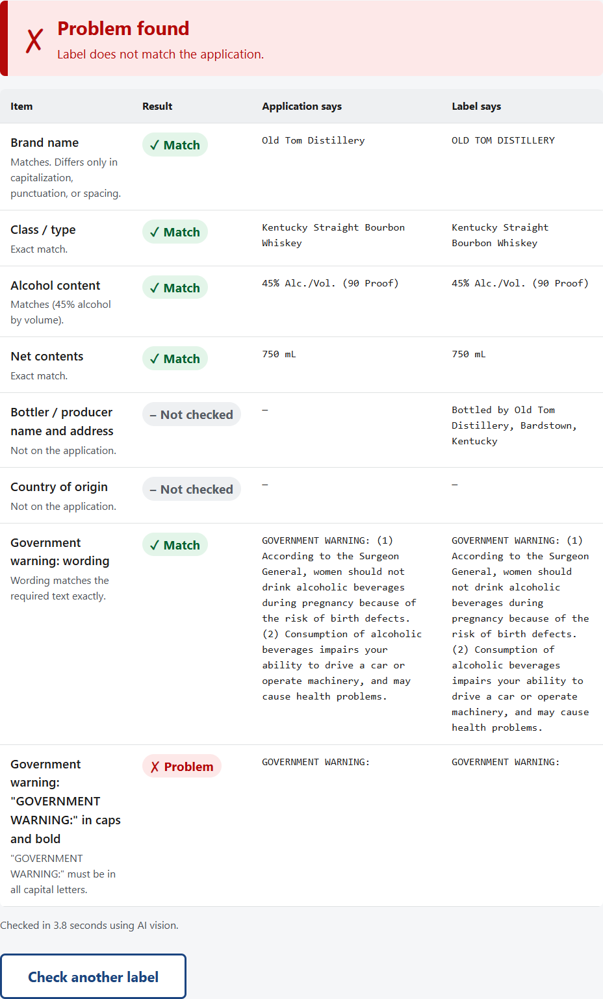
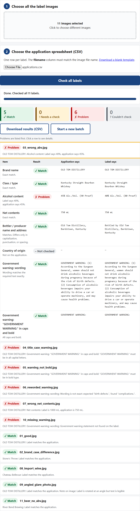

# TTB Label Verification Prototype

An AI-assisted tool that checks alcohol beverage label artwork against the data on its COLA application, including the exact Government Health Warning. It returns a field-by-field verdict in about 4 seconds.

**Live demo:** https://ttb-label-verifier.jollysand-f9381f43.westus.azurecontainerapps.io
(No login needed. Sample labels to try are in [`samples/labels/`](samples/labels/), and a matching batch spreadsheet is at [`samples/labels/applications.csv`](samples/labels/applications.csv).)

| Single label | Batch (many labels at once) |
|---|---|
|  |  |

---

## Contents
- [What it does](#what-it-does)
- [How the stakeholder requirements are met](#how-the-stakeholder-requirements-are-met)
- [How it works](#how-it-works)
- [Run it locally](#run-it-locally)
- [Testing and evaluation](#testing-and-evaluation)
- [Deployment](#deployment)
- [Approach, tools, and key decisions](#approach-tools-and-key-decisions)
- [Assumptions](#assumptions)
- [Limitations and trade-offs](#limitations-and-trade-offs)
- [Project structure](#project-structure)
- [How AI was used to build this](docs/AI_USAGE.md)

---

## What it does

**One label:** upload a photo of the label, type in what the application says, and click **Check label**. You get:
- An overall verdict: **✓ Label matches**, **! Needs a quick check**, or **✗ Problem found**.
- A row for each field showing the application value next to the label value, the result, and a plain-English reason.

**Many labels at once:** choose any number of label images plus a CSV with one row per application ([template](app/static/batch_template.csv)). Labels are checked 3 at a time with a progress bar and time remaining. Results list problems first, each row expands to show details, and everything can be downloaded as a CSV.

**Fields checked:**

| Field | Rule |
|---|---|
| Brand name, Class/type | Must match, ignoring capitalization, punctuation, and spacing (`STONE'S THROW` = `Stone's Throw`). Near-misses (e.g. one letter off) → *Needs review*. |
| Alcohol content | Compared numerically: `45%` = `45% Alc./Vol. (90 Proof)` = `90 Proof`. Also catches labels whose % and proof disagree. Required for spirits, optional for wine/beer. |
| Net contents | Unit-aware: `750 mL` = `75 cl`, `12 fl oz` = `12 FL. OZ.` |
| Bottler / producer | Ignores the role phrase: `Bottled by Old Tom Distillery…` = `Old Tom Distillery…` (optional field) |
| Country of origin | Knows common aliases: `Product of U.S.A.` = `United States` (optional field; imports) |
| Government warning (wording) | Must match 27 CFR 16.21 **word for word**. Differences are quoted, e.g. *expected "birth defects." found "complications."* |
| Government warning (heading) | `GOVERNMENT WARNING:` must be **all capitals** and **bold**. `Government Warning:` → fail. |

---

## How the stakeholder requirements are met

| Stakeholder need | How it's handled |
|---|---|
| **Results in ~5 seconds** or "nobody's going to use it" (Sarah) | Measured **~4.0–4.2s median** per label (Claude Sonnet 5 with thinking off; images downscaled before sending). One server instance is always running, so there's no cold start. See [latency measurements](#testing-and-evaluation). |
| **"Something my mother could figure out"** (Sarah) | One page, numbered steps, large type (~19px base), 60px buttons, results shown as icon + word + color (never color alone), plain-language messages, keyboard navigable, visible focus rings, works on phones. |
| **Batch uploads** of 200–300 labels (Sarah, Janet) | "Many labels at once" tab: images + CSV, progress bar, retries, problems-first results, CSV export. |
| **Judgment on trivial differences** (Dave: `STONE'S THROW` vs `Stone's Throw`) | Normalization rules treat case/punctuation/spacing differences as a match **and say so** ("Matches. Differs only in capitalization…"). Real near-misses go to *Needs review*, not auto-fail. |
| **Warning must be exact; heading all caps and bold** (Jenny) | Word-for-word comparison against the regulation text, plus separate caps and bold checks. Title case, rewording, non-bold, and a missing warning are all caught (see sample labels 04, 05, 06, 10). |
| **Imperfect photos: angles, glare, lighting** (Jenny) | The vision model reads angled/glared photos (sample 09 passes). Phone rotation is fixed automatically. If a photo is unreadable, the tool says so and suggests requesting a better image instead of guessing. |
| **Firewall blocks many cloud ML endpoints** (Marcus) | Extraction sits behind a swappable provider interface. An **offline OCR mode** (Tesseract, bundled in the container, no outbound network) is one click away under *Settings*. The AI provider can be pointed at an Azure-hosted model in production. |
| **On Azure; standalone, no COLA integration** (Marcus) | Deployed on **Azure Container Apps**. A standalone HTTP service with an OpenAPI spec at `/docs`, easy to call from .NET later. |
| **Don't store anything sensitive** (Marcus) | Nothing is written to disk or a database. Images are processed in memory and discarded after the response. The API key is an Azure secret, not in code. |

---

## How it works

```
 Label image ──► Prepare image ──► Extract (read the label) ──► Compare (rules) ──► Verdict + reasons
                 auto-rotate,       Claude vision (default)      deterministic,       pass / needs review /
                 downscale          or offline Tesseract OCR     unit-tested code     fail, per field
 Application data (form or CSV row) ─────────────────────────────────┘
```

**Key design choice: AI reads, code judges.** The AI model only *transcribes* what's printed on the label into structured fields, via JSON-schema structured output. Deciding whether a label passes is done by plain, unit-tested Python rules ([`app/verification/`](app/verification/)). This means:
- Every verdict comes with the exact values compared and the rule applied, so it's explainable and auditable.
- The same input always gets the same verdict.
- The AI can't "hallucinate a pass". When the tool isn't sure (a field not found, bold unclear, OCR mode), the answer is **Needs review**, leaving the final call to the agent.

---

## Run it locally

**Prerequisites:** Python 3.11+, and an Anthropic API key (for the default AI mode). Tesseract is only needed for offline OCR mode outside Docker.

```bash
git clone https://github.com/omarjaafar/ttb-label-verifier.git
cd ttb-label-verifier

python -m venv .venv
# Windows:        .venv\Scripts\activate
# macOS / Linux:  source .venv/bin/activate
pip install -r requirements-dev.txt

cp .env.example .env          # Windows PowerShell: copy .env.example .env
# edit .env and set ANTHROPIC_API_KEY=...

uvicorn app.main:app --reload
```

Open http://localhost:8000. API docs are at http://localhost:8000/docs.

**Or with Docker** (includes Tesseract for offline mode):
```bash
docker build -t ttb-label-verifier .
docker run -p 8000:8000 --env-file .env ttb-label-verifier
```

**Configuration** (environment variables, all optional except the key):

| Variable | Default | Purpose |
|---|---|---|
| `ANTHROPIC_API_KEY` | none | Required for the AI extraction mode |
| `EXTRACTION_PROVIDER` | `claude` | `claude` or `ocr` (offline Tesseract). The UI can override this per request under *Settings*. |
| `CLAUDE_MODEL` | `claude-sonnet-5` | Vision model used for extraction |
| `CLAUDE_THINKING` | `disabled` | `adaptive` enables model reasoning (slower) |
| `EXTRACTION_TIMEOUT_S` | `15` | Per-request ceiling for the model call |
| `MAX_UPLOAD_MB` | `15` | Upload size limit |
| `RATE_LIMIT_PER_MINUTE` | `60` | Checks per minute per visitor (batch mode waits and retries automatically) |
| `RATE_LIMIT_PER_DAY` | `1000` | Checks per day across all visitors, to cap API spend on the public demo |

**Batch CSV format:** one row per label. Required columns: `filename`, `brand_name`, `class_type`, `net_contents`. Optional: `beverage_type` (`spirits`/`wine`/`beer`, default spirits), `alcohol_content`, `bottler_name_address`, `country_of_origin`. The `filename` must match the uploaded image's file name. [Template](app/static/batch_template.csv).

**API:** `POST /api/verify` (multipart: `image` + the fields above) returns JSON with `overall`, `summary`, per-field `fields[]`, `provider`, and `elapsed_ms`. `GET /health` is a liveness check.

---

## Testing and evaluation

```bash
pytest                                   # 67 unit + API tests, no network or API key needed
python samples/generate_samples.py       # regenerate the synthetic test labels
python samples/run_eval.py               # run all sample labels through the real model; accuracy + latency
python samples/ui_smoke_test.py URL      # drive the real UI in a headless browser (single + batch)
```
(`run_eval.py` needs an API key. The browser test needs Edge installed or `playwright install chromium`.)

- **Unit tests** cover the judgment logic: normalization, ABV/proof math, unit conversion, bottler prefixes, country aliases, every warning rule, rate limiting, and API error handling (fake extractor, no network).
- **Sample labels** ([`samples/labels/`](samples/labels/)): 11 synthetic labels, each built to exercise one rule: a correct label, case-only brand difference, wrong ABV, title-case warning, non-bold heading, reworded warning, wrong volume, imported wine with metric units, an angled and glare-affected "phone photo", a missing warning, and a beer with no ABV.
- **Latest live results:** **11/11 correct**, median **4.2s**, max **4.6s** (all 11 running at once). Batch of 11 through the deployed UI: ~17s.

**Model and latency comparison** (same label, sequential runs):

| Configuration | Correct | Time per label |
|---|---|---|
| **Claude Sonnet 5, thinking off (chosen)** | ✓ | **~3.6s, consistent** |
| Claude Opus 5, adaptive thinking | ✓ | 4.1–5.8s |
| Claude Opus 5, thinking off | ✓ | 3.3–6.2s |
| Claude Haiku 4.5 | ✓ | 3.8–7.7s (inconsistent) |

---

## Deployment

Hosted on **Azure Container Apps** (West US), because Treasury/TTB already runs on Azure. The API key is stored as a Container Apps secret, the container runs as a non-root user, and one replica is always on to avoid cold starts.

To redeploy after changes (student subscriptions block Azure cloud builds, so the image is built locally):
```bash
docker build -t <registry>.azurecr.io/ttb-label-verifier:<tag> .
az acr login -n <registry>
docker push <registry>.azurecr.io/ttb-label-verifier:<tag>
az containerapp update -n ttb-label-verifier -g rg-ttb-label-verifier --image <registry>.azurecr.io/ttb-label-verifier:<tag>
```
[`scripts/schedule-teardown.ps1`](scripts/schedule-teardown.ps1) schedules automatic deletion of the prototype's Azure resources through a self-testing Logic App.

---

## Approach, tools, and key decisions

**Tools:** Python 3.11 · FastAPI · Anthropic Claude API (Claude Sonnet 5 vision, structured JSON output) · Tesseract OCR (offline fallback) · Pillow · RapidFuzz · plain HTML/CSS/JS (no framework or build step) · pytest · Playwright (browser tests) · Docker · Azure Container Apps + Azure Container Registry. Built with Claude Code as an AI pair-programmer; see [docs/AI_USAGE.md](docs/AI_USAGE.md).

**Process:** I started by pulling concrete requirements out of the four stakeholder interviews (the table above), then made each decision against them, measured where possible, and kept a decision log with alternatives and trade-offs.

| Decision | Why | Trade-off accepted |
|---|---|---|
| **AI extracts, rules judge** | Explainable, deterministic, testable verdicts, which suits a compliance setting. Uncertainty becomes *Needs review*. | Rules are hand-written and won't cover every edge case. |
| **Claude Sonnet 5, thinking off** | The only configuration that was both fully accurate and consistently under 5s. The job is transcription, not reasoning, so extra model deliberation added latency without value. | Less headroom on extremely hard images. The model is one setting away (`CLAUDE_MODEL`). |
| **Swappable extraction + offline OCR** | Directly answers the firewall concern that sank the previous vendor. | OCR can't judge bold type, so that check becomes *Needs review* in OCR mode. |
| **Python + FastAPI** | Best imaging/AI ecosystem, async for concurrent batch calls, auto OpenAPI docs. | Not .NET like COLA, but it's a standalone HTTP service, so the language doesn't matter for integration. |
| **Plain HTML frontend** | One page doesn't need a framework. No build step, and full control over accessibility. | Batch UI state is managed by hand (still ~250 lines). |
| **Batch runs in the browser, 3 at a time** | 300 photos can be close to 1 GB, too big for one upload. Per-label requests give real progress, isolate failures, and keep the server stateless. | The tab must stay open. ~7 min for 300 labels at entry-tier API rate limits. |
| **One rule set for all beverage types** | Core checks are shared; the main difference (ABV optional for wine/beer) is a selector. | Type-specific rules (wine appellation, sulfites, spirits age statements) are future work. |
| **No custom image preprocessing** | The vision model already handles angled/glare photos. OCR-style cleanup can hurt it and adds latency. Unreadable images are flagged honestly. | Very poor photos go back to the agent rather than being "rescued". |
| **Azure Container Apps** | Matches Treasury's cloud. HTTPS, secrets, and scaling built in. | More setup than a one-click host. |

The full decision log with alternatives is in [CLAUDE.md](CLAUDE.md#decisions-log).

---

## Assumptions

- **The application data is typed or uploaded by the agent.** No COLA integration, per the IT interview.
- **Pass / needs review / fail supports the agent; it doesn't replace them.** The agent makes the final decision.
- **Government warning text** is the one prescribed in 27 CFR 16.21. The body is compared case-insensitively and whitespace-normalized; the heading's capitalization is checked separately.
- **"Bold"** is judged visually by the vision model (heavier stroke than the surrounding text). Font-size minimums for the warning are **not** checked, because they depend on container size, which the tool doesn't know.
- **If a required field isn't found on the label**, the result is *Needs review* (a likely read miss) rather than *Fail*. The exception is the government warning: it's mandatory and easy to detect, so a missing warning is a hard fail.
- **Alcohol content** is required for distilled spirits and optional for wine and malt beverages.
- **Test labels are synthetic**, generated with code so each one targets a specific rule. Real-world label photos would be the next step for evaluation.

## Limitations and trade-offs

- **Not a full TTB rule engine.** It checks the fields in the brief, not every regulation (e.g. type size, placement, "same field of vision", wine appellation or vintage, sulfite or allergen statements, standards of identity).
- **External AI API in the prototype.** The default mode calls Anthropic's API. For production inside Treasury's network, this would route through an approved endpoint (e.g. Claude through Microsoft Foundry on Azure) or use the offline OCR mode.
- **No authentication on the demo URL.** It's intentionally open so reviewers can test it, and protected by rate limits instead (60 checks/min per visitor, 1,000/day total). The limits are kept in memory per server instance. Production would sit behind Treasury SSO (Entra ID), with shared rate limiting at the gateway (e.g. Azure API Management) plus request logging and an audit trail.
- **Batch throughput** is capped by API rate limits (~50 requests/min at entry tier). For very large overnight runs, the Message Batches API (asynchronous, lower cost) would be the natural fit.
- **Offline OCR mode** is less accurate: it can't verify bold type and may misread small text, so those checks return *Needs review*.
- **Accuracy is measured on 11 synthetic labels.** That validates the logic end to end, but it isn't a substitute for testing on real label photos.

---

## Project structure

```
app/
  main.py                 FastAPI routes (/, /api/verify, /health)
  ratelimit.py            per-visitor and daily limits for the public demo
  config.py               environment settings
  models.py               request/response and extraction data shapes
  imaging.py              upload validation, auto-rotate, downscale
  extraction/             "read the label" providers
    claude.py             Claude vision with structured output
    ocr.py                offline Tesseract fallback
  verification/           "judge the label" (deterministic)
    normalize.py          text / ABV / volume / country / bottler normalization
    rules.py              per-field comparison rules + government warning checks
    verifier.py           runs all rules, rolls up the overall verdict
  static/                 single-page UI (index.html, app.js, batch.js, styles.css, CSV template)
tests/                    pytest unit + API tests
samples/                  label generator, 11 sample labels + CSV, live eval, browser smoke test
scripts/                  Azure teardown scheduler
docs/                     assignment text, AI usage write-up, screenshots
Dockerfile
```
